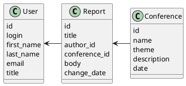

# Компонентная архитектура
<!-- Состав и взаимосвязи компонентов системы между собой и внешними системами с указанием протоколов, ключевые технологии, используемые для реализации компонентов.
Диаграмма контейнеров C4 и текстовое описание. 
-->
## Компонентная диаграмма

```plantuml
@startuml 
!include https://raw.githubusercontent.com/plantuml-stdlib/C4-PlantUML/master/C4_Container.puml

AddElementTag("microService", $shape=EightSidedShape(), $bgColor="CornflowerBlue", $fontColor="white", $legendText="microservice")
AddElementTag("storage", $shape=RoundedBoxShape(), $bgColor="lightSkyBlue", $fontColor="white")

Person(admin, "Администратор")
Person(moderator, "Модератор")
Person(user, "Пользователь")

System_Ext(web_site, "Клиентский веб-сайт", "HTML, CSS, JavaScript, React", "Веб-интерфейс")

System_Boundary(conference_site, "Сайт блогов") {
   'Container(web_site, "Клиентский веб-сайт", ")
   Container(client_service, "Сервис авторизации", "C++", "Сервис управления пользователями", $tags = "microService")    
   Container(post_service, "Сервис конференций", "C++", "Сервис управления конференциями", $tags = "microService") 
   Container(blog_service, "Сервис докладов", "C++", "Сервис управления докладами", $tags = "microService")   
   ContainerDb(db, "База данных", "PostgreSQL", "Хранение данных о конференциях, докладах и пользователях", $tags = "storage")
   
}

Rel(admin, web_site, "Просмотр, добавление и редактирование информации о пользователях, конференциях и докладах")
Rel(moderator, web_site, "Модерация контента и пользователей")
Rel(user, web_site, "Регистрация, просмотр информации о конференциях и докладах и запись на них")

Rel(web_site, client_service, "Работа с пользователями", "localhost/person")
Rel(client_service, db, "INSERT/SELECT/UPDATE", "SQL")

Rel(web_site, post_service, "Работа с конференциями", "localhost/conf")
Rel(post_service, db, "INSERT/SELECT/UPDATE/DELETE", "SQL")

Rel(web_site, blog_service, "Работа с докладами", "localhost/reports")
Rel(blog_service, db, "INSERT/SELECT/UPDATE/DELETE", "SQL")

@enduml
```
## Список компонентов  

### Сервис авторизации
**API**:
-	Создание нового пользователя
      - входные параметры: login, пароль, имя, фамилия, email, обращение (г-н/г-жа)
      - выходные параметры: отсутствуют
-	Поиск пользователя по логину
     - входные параметры:  login
     - выходные параметры: имя, фамилия, email, обращение (г-н/г-жа)
-	Поиск пользователя по маске имени и фамилии
     - входные параметры: маска фамилии, маска имени
     - выходные параметры: login, имя, фамилия, email, обращение (г-н/г-жа)

### Сервис конференций
**API**:
- Создание блога
  - Входные параметры: название конференции, тема, аннотация, дата проведения
  - Выходыне параметры: идентефикатор конференции
- Получение списка всех конференций
  - Входные параметры: отсутствуют
  - Выходные параметры: массив конференций, где для каждой указаны ее идентификатор, название, тема, аннотация, автор и дата проведения

### Сервис докладов
**API**:
- Создание поста
  - Входные параметры: заголовок доклада, автор, конференция, содержания доклада
  - Выходные параметры: идентификатор доклада
- Получение списка докладов в конференции
  - Входные параметры: конференция
  - Выходные параметры: массив с докладами(идентификатор, заголовок доклада, автор, конференция, содержания доклада)
- Получение доклада
  - Входные параметры: идентификатор доклада
  - Выходные парамтеры: заголовок доклада, автор, конференция, содержания доклада
- Изменение доклада
  - Входные параметры: идентификатор доклада, заголовок доклада, автор, конференция, содержания доклада
  - Выходные параметры: отсутствуют


### Модель данных
